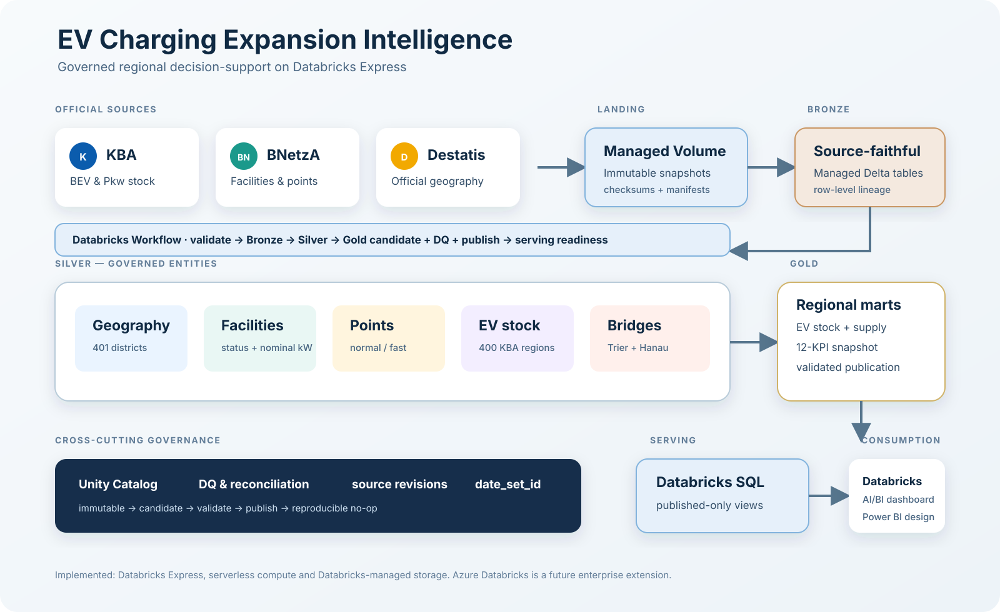
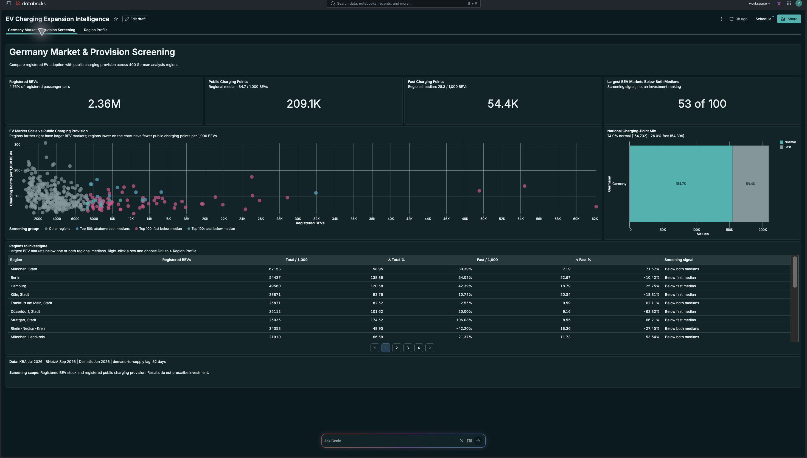
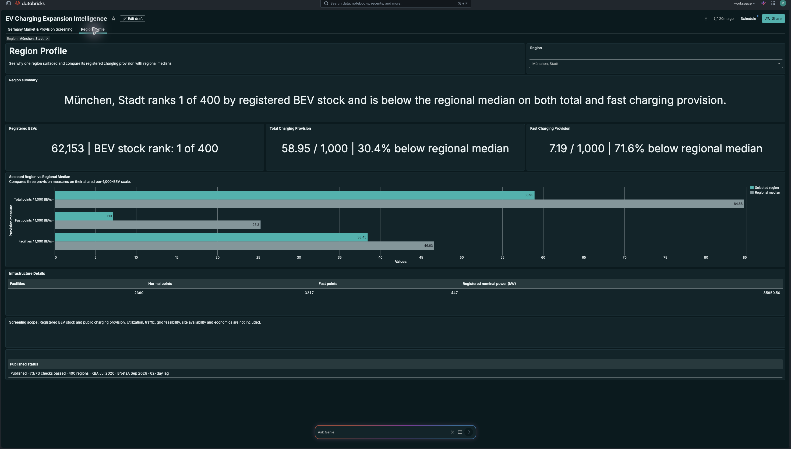

# EV Charging Expansion Intelligence


Identifies German regions where registered public charging provision is comparatively low relative to registered battery electric vehicle adoption, using official KBA, BNetzA and Destatis data.

## Dashboard preview


*The executive report compares market scale with total and fast public charging provision across 400 governed analysis regions.*

| 400 | 2.36M | 209.1K | 73/73 |
|---:|---:|---:|---:|
| analysis regions | registered BEVs | in-service charging points | blocking checks passed |

[Databricks dashboard](#databricks-dashboard) · [Power BI dashboard](#power-bi-dashboard) · [Architecture](docs/architecture.md) · [Methodology](docs/methodology.md) · [Reproduction](docs/reproduction.md)

## Business problem

National totals do not show whether charging provision is distributed in line with regional EV adoption. A network planning or commercial analytics team needs a consistent way to compare market scale with registered public charging provision before deciding which regions deserve deeper analysis.

The project asks which German regions have comparatively low registered public charging provision relative to their registered BEV base. It does not claim causal demand effects, required charger quantities, optimal sites, grid feasibility or investment readiness.

## Why this matters

Absolute charger counts can be misleading. A region with many charging points may support a much larger BEV base than a region with fewer points. This project keeps market scale visible while normalizing registered facilities, total points, fast points and facility nominal power per 1,000 registered BEVs.

The result is a screening layer that helps a team decide where utilization, traffic, competition, site, grid and economic evidence should be collected next.

## How I solved it

I combined three official German datasets at a governed 400-region grain. The workflow validates exact source revisions, preserves source-faithful Bronze tables, resolves entities and geography in Silver, builds regional KPI candidates in Gold, runs 73 blocking checks and publishes only validated output.

The core implementation challenge was geography. KBA reports 400 vehicle-registration regions, current Destatis geography has 401 districts, and BNetzA provides district labels rather than the KBA regional key. A controlled bridge accounts for every current district, including Trier's two-to-one aggregation and Hanau's effective-dated administrative change.

## Tools and technologies

- Python 3.12, PySpark and Spark SQL
- Databricks, Unity Catalog and Delta Lake
- Databricks Asset Bundles and Databricks AI/BI dashboards
- Power BI Project, Power Query and DAX
- Pytest and GitHub Actions
- JSON, YAML, SQL and Mermaid documentation

The implemented workspace used Databricks Express with serverless compute and Databricks-managed storage. Azure Databricks is the intended production extension, but Azure infrastructure is not claimed as implemented in this release.

## System architecture



Bronze protects source fidelity. Silver owns entity and geographic reconciliation. Gold owns the governed KPI formulas and publication decision. Both dashboards read only the published serving views. See [the architecture document](docs/architecture.md) for the geography and publication flows.

## Data sources and analytical grain

| Source | Reference date | Purpose | Source grain |
|---|---|---|---|
| KBA FZ 27.15 | 1 July 2026 | Registered passenger-car and BEV stock | One Zulassungsbezirk |
| BNetzA Ladesäulenregister | 1 September 2026 | Registered public charging facilities and points | One Ladeeinrichtung |
| Destatis GV-ISys | 30 June 2026 | Current district codes and names | One administrative unit |

The analytical output contains 400 KBA-aligned regions for one approved snapshot. The KBA-to-BNetzA source lag is 62 days. Raw provider files are not redistributed. Source URLs, filenames, sizes and SHA-256 checksums are recorded in [`data/source_manifest.json`](data/source_manifest.json).

## KPI design

The published layer contains 12 governed measures covering BEV and passenger-car stock, BEV penetration, in-service facilities, total, normal and fast points, registered facility nominal power, and four per-1,000-BEV provision ratios.

Operational charging KPIs include only BNetzA rows with exact `Status = 'In Betrieb'`. The 20 maintenance facilities remain traceable but are excluded. Registered facility nominal power is counted once per facility. It is not grid capacity, site connection capacity, simultaneous deliverable power, utilization or energy delivered.

Regional medians are descriptive benchmarks, not targets or service standards. No composite investment score is published. Full definitions are in the [KPI dictionary](docs/kpi_dictionary.md).

## Databricks dashboard

The Databricks dashboard demonstrates the governed analytics and platform implementation. Page 1 screens national scale and regional provision. Page 2 profiles one selected region against the regional medians. The Region Profile defaults to `München, Stadt` and cannot display an aggregate `All` state as if it were one region.





The successful six-task workflow is shown in [`dashboards/databricks/03_workflow_success.png`](dashboards/databricks/03_workflow_success.png). A combined PDF is available at [`dashboards/databricks/databricks-dashboard.pdf`](dashboards/databricks/databricks-dashboard.pdf).

## Power BI dashboard

Power BI uses the same two published Gold views but provides a lighter two-page executive report. The repository contains the complete PBIP source, its adjacent Report and SemanticModel folders, 74 measures, the theme and parameterized connection documentation. It does not claim Power BI Service deployment.


Open the [Power BI project guide](powerbi/README.md) for the model and refresh instructions. The two final pages are also available as [`dashboards/powerbi/power-bi-dashboard.pdf`](dashboards/powerbi/power-bi-dashboard.pdf).

## Key findings

- Germany has 2,362,218 registered BEVs and 209,098 in-service registered public charging points in the approved snapshot.
- 53 of the 100 largest BEV markets are below both the regional total and fast provision medians.
- `München, Stadt` has the largest registered BEV stock at 62,153 and sits below both medians at 58.95 total and 7.19 fast points per 1,000 BEVs.
- Stuttgart has high total provision at 174.52 points per 1,000 BEVs but low fast provision at 8.55, showing why charger mix must remain visible.
- Euskirchen has the lowest total provision ratio in the snapshot at 31.68 points per 1,000 BEVs.

BEV stock is shown as market scale and is also the denominator of the per-1,000-BEV measures. The scatterplots are screening views, not correlation or causal analyses.

## Business recommendations and recommended next analyses

| Region or pattern | Observation | Business interpretation | Recommended next analysis |
|---|---|---|---|
| München, Stadt | Largest BEV stock and below both provision medians | Large registered EV market with comparatively low registered provision | Test utilization, traffic, competitor coverage, site availability, grid feasibility and economics |
| Stuttgart | High total provision and low fast provision | Total charger counts can hide charging-mix differences | Investigate fast-charging use cases and corridor demand |
| Euskirchen | Lowest total provision ratio | Low normalized registered provision in a smaller EV market | Validate utilization, access and network coverage before drawing conclusions |
| Rhein-Neckar-Kreis | Large BEV market below the total provision median | Market scale and normalized provision diverge | Compare traffic, competitive coverage and feasible sites |
| Top 100 BEV markets | 53 regions below both medians | Scale and provision do not move uniformly | Use the cohort as a shortlist for commercial screening |

These are recommended next analyses, not investment recommendations.

## Data quality and engineering

- Exact source revisions are bound to filenames, sizes and SHA-256 checksums.
- Repeated runs validate existing content and return a no-op instead of duplicating records.
- Unmatched geography is surfaced and tested rather than silently dropped.
- Charging facilities, points and connectors remain separate entities.
- Gold publication is isolated from the prior release and blocked by any failed check.
- Controlled schema and checksum failures were rejected while the prior published Gold result remained unchanged.
- The final published controls reconcile to 400 regions, 2,362,218 BEVs, 209,098 points and 9,086,313.500 kW of registered cumulative facility nominal power.

See [data quality](docs/data_quality.md) and the public machine-readable validation evidence in [`evidence/`](evidence/).

## What I learned

The hardest part was not calculating ratios. It was deciding what each source row represents, proving that the geographic joins preserve all regions, and keeping infrastructure concepts separate. A small number of explicit rules, such as exact operational status, a governed 401-to-400 bridge and candidate-only publication, prevented much larger downstream errors.

The project also reinforced when not to use machine learning. A single cross-sectional snapshot has no suitable historical target for forecasting. Transparent ratios and benchmarks are more defensible until utilization and time-series evidence exist.

## How to reproduce

Use Python 3.12, install the requirements and run the public test suite:

```bash
python -m pip install -r requirements.txt
pytest -q --ignore=tests/test_approved_source_conformance.py
python scripts/validate_public_release.py
```

Obtain the three official source files by following [`data/README.md`](data/README.md). Then follow [`docs/reproduction.md`](docs/reproduction.md) to bootstrap your own catalog, validate and deploy the Bundle, run the six-task workflow, and validate the published controls. No workspace host, warehouse ID, account identifier or credential is stored in the repository.

## Repository structure

```text
.github/              public CI
config/               source revisions, geography rules and KPI contracts
data/                 source manifest and compact reference outputs
databricks/           notebooks, dashboard template, SQL and job definitions
dashboards/            final Databricks and Power BI screenshots and PDFs
docs/                 architecture, method, quality and reproduction guides
evidence/             compact public validation evidence
powerbi/              final PBIP, Report, SemanticModel, DAX and theme
resources/            Databricks Bundle workflow and dashboard resources
scripts/              bootstrap, rendering and validation tools
src/ev_charging/      reusable pipeline and contract logic
tests/                unit, contract and package tests
```

Raw provider files, private archives, local caches, internal development reports and workspace-specific identifiers are excluded.

## Limitations

- Registered BEV stock is a demand proxy, not observed charging demand.
- The BNetzA register does not provide utilization, reliability or queueing.
- Source dates differ by up to 62 days.
- The snapshot is cross-sectional and cannot support trend, forecast or causal claims.
- Traffic, private charging, competitor coverage, site constraints, grid feasibility, cost and revenue are not included.
- The project does not estimate charger quantities, optimal locations, ROI or investment certainty.

## Future work

- Add utilization, uptime and queueing evidence.
- Add traffic, competitive coverage, site constraints, grid feasibility and commercial economics.
- Accumulate governed historical snapshots before trend or forecast work.
- Deploy the same contracts on Azure Databricks with ADLS Gen2, Microsoft Entra identities, networking, secrets and environment promotion.
- Add Power BI Service deployment only when a durable workspace and refresh identity exist.

## License and data attribution

Project source code is licensed under [MIT](LICENSE). Provider data is not covered by the MIT license and is not redistributed.

- **KBA:** Kraftfahrt-Bundesamt, FZ 27.15, reference date 1 July 2026, processed by this project; Datenlizenz Deutschland Namensnennung 2.0.
- **BNetzA:** Bundesnetzagentur.de, Ladesäulenregister, reference date 1 September 2026, processed by this project; CC BY 4.0.
- **Destatis:** © Statistisches Bundesamt (Destatis), GV-ISys, administrative status 30 June 2026, processed by this project. Reproduction and distribution, including excerpts, are permitted with source attribution under the notice carried by the approved workbook.

See [`data/README.md`](data/README.md) for exact source pages, license links, attribution wording and retrieval instructions.
