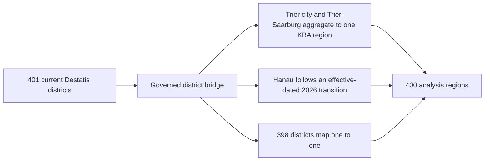
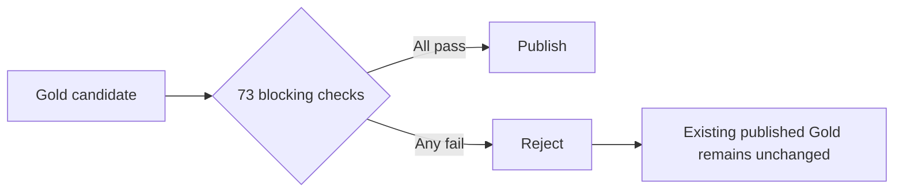

# Architecture

The project turns three official German datasets into a governed regional screening product. The analytical grain is one KBA-aligned analysis region and one approved source snapshot.

## Why this design

Bronze preserves source meaning and parsing lineage. Silver resolves facility, charging-point and geography semantics. Gold owns the published KPI formulas and regional benchmarks. Dashboards consume only two published views, so presentation tools do not reimplement governed business logic.

The workflow has six ordered tasks: immutable source landing, source validation, Bronze ingestion, Silver transformation, Gold candidate validation and publication, and serving readiness. Every downstream task requires its predecessor to succeed.

## Geography reconciliation

Postal code is not a canonical geographic key. BNetzA district and state labels reconcile to the current Destatis district reference, then the district bridge maps them to the 400 KBA-aligned analysis regions. Unmatched records fail quality checks rather than disappearing from an inner join.

## Publication safety

The dashboard and Power BI model read only:

- `<catalog>.gold.vw_powerbi_region_kpi_published`
- `<catalog>.gold.vw_powerbi_date_set_quality`

See [methodology.md](methodology.md) for analytical rules and [reproduction.md](reproduction.md) for deployment steps.
