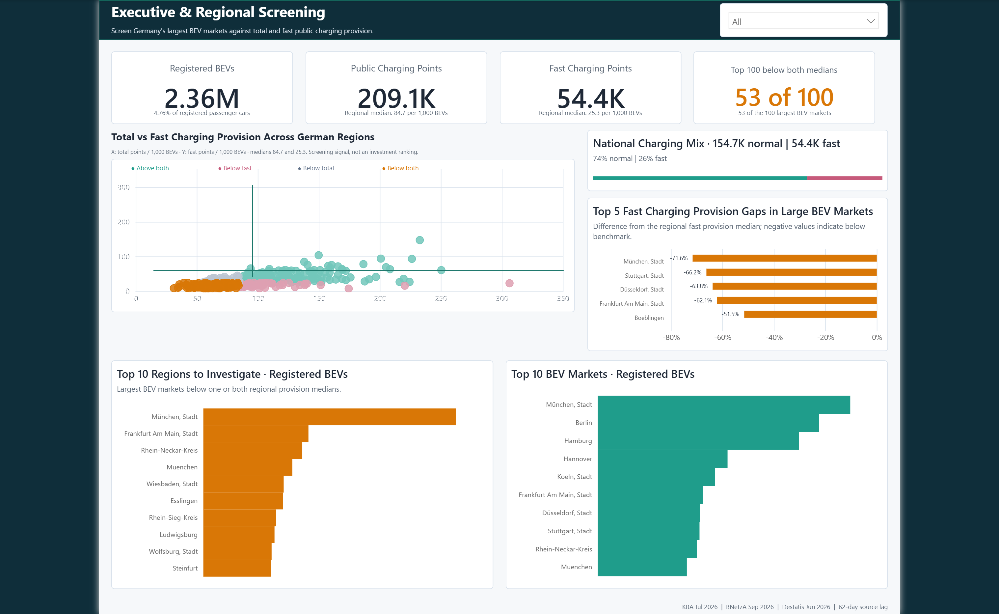
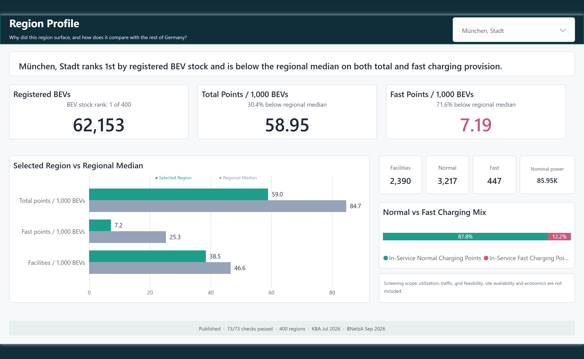

# EV Charging Intelligence for Power BI

This folder contains the final two-page Power BI Project source. It complements the Databricks dashboard with a concise executive report while using the same published Gold views and governed KPI definitions.

## Open the project

Open [`EV Charging Intelligence.pbip`](EV%20Charging%20Intelligence.pbip) in a current version of Power BI Desktop on Windows. Keep these three items together:

- `EV Charging Intelligence.pbip`
- `EV Charging Intelligence.Report/`
- `EV Charging Intelligence.SemanticModel/`

The report definition references the adjacent semantic model by relative path. Moving only the `.pbip` file will break the project.

## Report pages

1. **Executive and Regional Screening** presents national scale, provision benchmarks, the 53-of-100 screening signal and regions that warrant further investigation.
2. **Region Profile** compares one selected region with regional medians and states the evidence still required before an investment decision.

The report is a screening tool. It does not estimate utilization, recommend sites or claim investment readiness.

## Final report images

These clean exports contain no Power BI Desktop ribbon, filter pane, local path or account information. A two-page PDF is available at [`../dashboards/powerbi/power-bi-dashboard.pdf`](../dashboards/powerbi/power-bi-dashboard.pdf).

## Connect to Databricks

The public semantic model contains placeholders instead of a live workspace host, warehouse identifier or catalog:

- `DATABRICKS_SERVER_HOSTNAME`
- `DATABRICKS_SQL_WAREHOUSE_ID`
- `DATABRICKS_CATALOG`

Replace these values in the `Dataset.tmdl` and `Regional KPI.tmdl` partition expressions before refreshing. Detailed permissions and refresh instructions are in [`CONNECTION.md`](CONNECTION.md).

The model imports only:

- `<catalog>.gold.vw_powerbi_region_kpi_published`
- `<catalog>.gold.vw_powerbi_date_set_quality`

## Supporting files

- [`measures.dax`](measures.dax) is a readable export of the 74 measures implemented in the semantic model.
- [`theme.json`](theme.json) is the exact theme resource embedded in the final report.
- [`model_contract.json`](model_contract.json) records the model grain, relationships and permitted Gold sources.
- [`SEMANTIC_MODEL.md`](SEMANTIC_MODEL.md) explains calculation ownership and filter context.
- [`REPORT_SPEC.md`](REPORT_SPEC.md) records the implemented page structure.
- [`power_query/`](power_query/) preserves parameterized source-query documentation from the design package.

Power BI Desktop cache folders, local settings, `.pbix` binaries and credentials are intentionally excluded. This repository does not claim a Power BI Service deployment or scheduled refresh.
